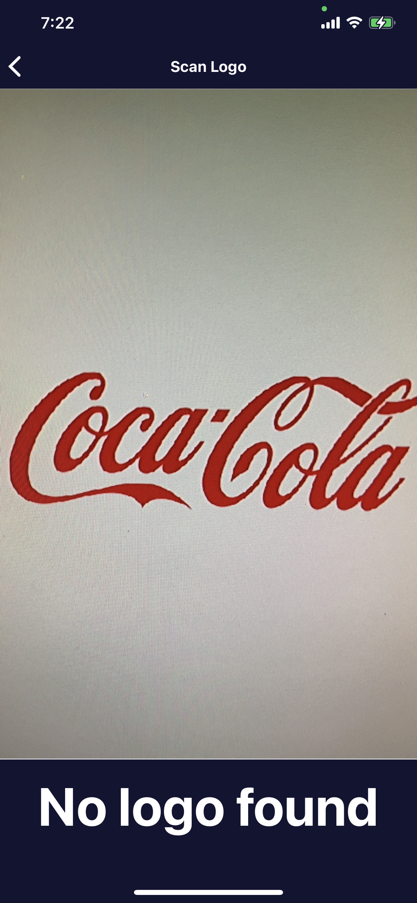

# passioapp

This is a simple RN application that uses native module to detect logos.

## How to Install

Clone the repo and run `npm install`

Open `passioapp.xcworkspace` located in the ios folder with Xcode and add a development team.

If the following error occurs:

```
building for ios simulator but the linked framework
```

In the build settings, under Build Options, set Validate Workspace to Yes.

If the following error occurs:

```
Showing Recent Messages
.../passioapp/ios/Pods/Target Support Files/Pods-passioapp/Pods-passioapp.debug.xcconfig: unable to open file (in target "passioapp" in project "passioapp")
```

In the Terminal, `cd` to the `ios` folder and run the following commands:

```
pod deintegrate
pod install
```

## Todo

Currently the application is not integrated with the Passio SDK. Will need to do further research into how to bridge Swift and React Native.

## Screenshots



